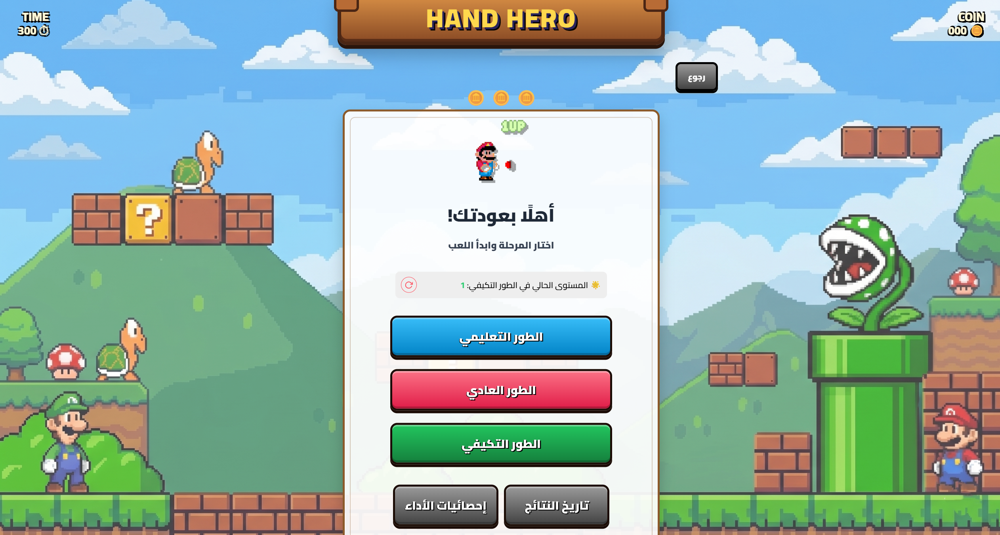
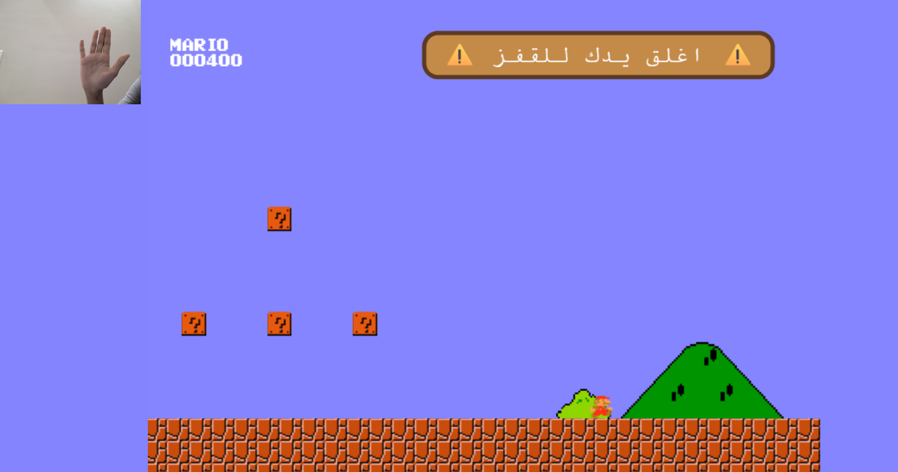
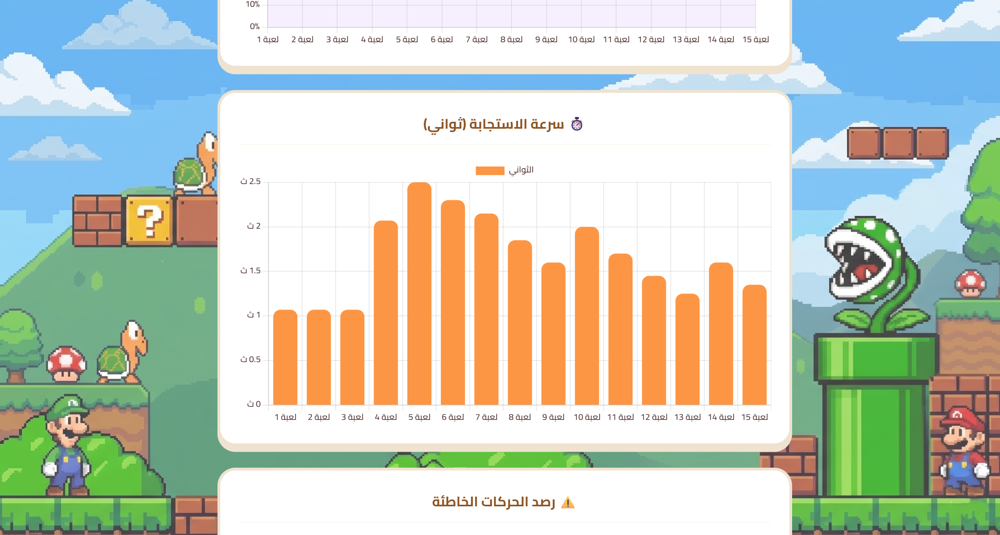

# 🎮 Hand Hero: Gesture-Based Game for Pediatric Rehabilitation

**Hand Hero** is an interactive, AI-powered system designed to assist children in their hand therapy and physical rehabilitation journeys. By leveraging computer vision and deep learning, the system transforms repetitive and mundane therapeutic exercises into an engaging, gamified experience. It tracks progress in real-time, eliminating the need for expensive specialized hardware or wearable sensors.

---

## ✨ Key Features

* **Real-Time Gesture Recognition:** Utilizes a standard webcam to capture and classify hand movements instantly, mapping them to in-game actions (e.g., Open Hand to move, Closed Fist to jump).
* **AI-Driven Inference:** Powered by a customized **ResNet-18** deep learning architecture trained specifically for precise hand gesture classification.
* **Child-Friendly GUI:** A vibrant, intuitive, and highly engaging user interface designed based on Human-Computer Interaction (HCI) principles for children.
* **Performance Tracking Dashboard:** Generates visual metrics and progress charts to help therapists and parents monitor the child's rehabilitation milestones over time.

---

## 📸 System Interfaces & GUI

> 💡 **Note for the team:** Place your interface screenshots inside a folder named `screenshots` in your root directory. Ensure the filenames match the paths below to render them correctly on GitHub.

### 1️⃣ Main Interface (الواجهة الأساسية)
This is the welcome screen and main dashboard of the application where users can log in, navigate, and prepare for their therapy sessions.


### 2️⃣ Gameplay & Interaction (اللعبة)
This screen showcases the interactive game interface where the child plays and performs therapy exercises using hand gestures captured by the webcam.


### 3️⃣ Performance Analytics & Statistics (الإحصاءات)
Displays the visual data, progress tracking graphs, and session history tailored for parents and healthcare providers to monitor improvement.


---

## 🛠️ Tech Stack

* **Frontend & UI Design:** HTML5, CSS3, JavaScript / Figma (Prototyping)
* **Backend API:** Python / FastAPI / Uvicorn
* **AI & Computer Vision:** PyTorch / ResNet-18 / OpenCV / MediaPipe
* **Testing Framework:** Pytest (for API, AI Integration, and Game Logic unit testing)

---

## 🚀 Deployment & Installation

The system operates on a modular Client-Server architecture. Follow these three steps to deploy and run the application locally:

### Step 1: Environment Preparation
* Ensure **Python 3.11+** is installed on the host machine.
* Clone or download this project repository containing both the backend scripts and frontend assets.

### Step 2: Backend (AI Server) Initialization
1. Open your terminal inside the `backend` directory.
2. Install the required libraries and dependencies:
   ```bash
   pip install fastapi uvicorn opencv-python mediapipe pillow torch torchvision
